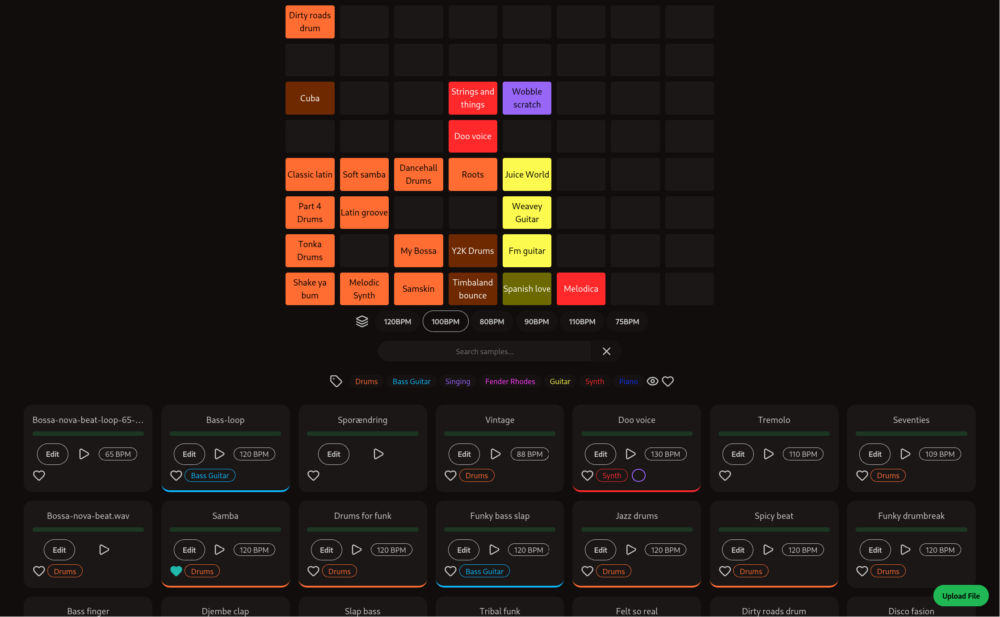

# Soundmachine
Create a layout of cool audio samples and have them automatically sync to your Launchpad for looping!




# Features

- Web Interface for audio sample management. 

- Add tags, bpm (auto detected based on filename) and mark samples as favourite. And you can of cause listen to the samples in the browser.
- Sort and search library by tags, bpm or if they are used. 
-  Arrange samples on the launchpad. Colours are picked with tags and can be overwritten to a custom colour.
- Create layers to better organise based on bpm, mood or whatever you like. Layers can be switched between on the launchpad itself.
- Basic controls on the launchpad itself: Move samples around, delete and mark favourite.
- Should work with any audio filetype that ffmpeg can handle.

# Compatible Launchpads

* Launchpad Pro

# Installation
Follow Dev setup for now. But want to create docker image.

# Dev setup
## Dependencies
The easiest is to use [Mise](https://mise.jdx.dev/).
It with help you install the dependencies:
* Python
* pnpm
* uv
* black
* git

Then run `git clone git@github.com:Alfenstein8/soundmachine.git`

## Running Server

The server hosts the web application and manages the sample library.

1. `cd server`
2. `mise trust && mise i`
3. `pnpm i`
4. `touch local.db` 
5. `pnpm db:migrate`
6. `pnpm dev`

## Running Client

The client is the device that connects the launchpad and plays the audio.

1. `cd client`
2. `mise trust && mise i` (or install dependencies manually. See `mise.toml`)
3. `uv run main.py`

## Database ER-Diagram


# Troubleshooting
## Getting`Cannot access file /usr/local/share/alsa/alsa.conf` on the launchpad
```sh
sudo mkdir  /usr/local/share/alsa
sudo ln -s /usr/share/alsa/alsa.conf /usr/local/share/alsa/alsa.conf
```

